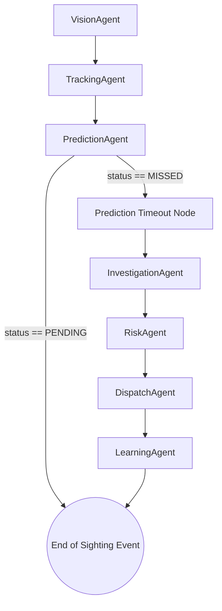

# SentinelAI System Architecture

SentinelAI is an Agentic Urban Safety Network utilizing a collaborative multi-agent architecture built on LangGraph.

## Core Flow and Agent Nodes

## Shared State Machine

All agent nodes interact with a centralized `SharedMemory` schema which contains:
- `tracked_entity`: Metadata description and tracking traces.
- `prediction`: Information regarding the next predicted cameras.
- `investigation`: Records of nodes checked on miss events.
- `risk_assessment`: Dynamic severity scoring and behavior flags.
- `dispatch_status`: Active unit allocations.
